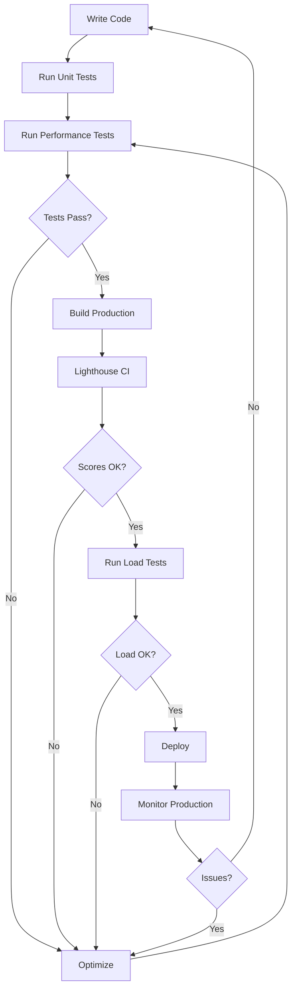

# Performance Testing Guide

## 🎯 Performance Testing Strategy

This guide covers comprehensive performance testing for the Auto Repair Shop management system.

## 📋 Table of Contents

1. [Frontend Performance](#frontend-performance)
2. [Backend/Database Performance](#backend-performance)
3. [Load Testing](#load-testing)
4. [Bundle Analysis](#bundle-analysis)
5. [Monitoring](#monitoring)

---

## 🖥️ Frontend Performance

### 1. Lighthouse CI

**Install:**

```bash
pnpm add -D @lhci/cli
```

**Run:**

```bash
# Build and test
pnpm build
pnpm lhci autorun

# Or specific URLs
pnpm lhci collect --url=http://localhost:3000/reception
```

**Configuration:** See `lighthouserc.js`

**Performance Targets:**

- Performance Score: > 85
- FCP (First Contentful Paint): < 2s
- LCP (Largest Contentful Paint): < 2.5s
- TBT (Total Blocking Time): < 300ms
- CLS (Cumulative Layout Shift): < 0.1

### 2. React Performance Testing

**Run performance tests:**

```bash
pnpm test __tests__/performance.test.tsx
```

**What it tests:**

- Component render time
- Re-render frequency
- Memory leaks
- TanStack Query cache performance

### 3. Bundle Size Analysis

**Analyze bundle:**

```bash
# Build with analysis
ANALYZE=true pnpm build

# Or use Next.js bundle analyzer
pnpm add -D @next/bundle-analyzer
```

**Add to `next.config.ts`:**

```typescript
const withBundleAnalyzer = require("@next/bundle-analyzer")({
  enabled: process.env.ANALYZE === "true",
});

module.exports = withBundleAnalyzer(nextConfig);
```

**Run:**

```bash
ANALYZE=true pnpm build
```

**Target bundle sizes:**

- First Load JS: < 200KB
- Route JS: < 100KB per page
- Shared chunks: Properly code-split

### 4. Core Web Vitals Monitoring

**Add to `app/layout.tsx`:**

```typescript
import { SpeedInsights } from "@vercel/speed-insights/next";
import { Analytics } from "@vercel/analytics/react";

export default function RootLayout({ children }) {
  return (
    <html>
      <body>
        {children}
        <SpeedInsights />
        <Analytics />
      </body>
    </html>
  );
}
```

---

## 🗄️ Backend Performance

### 1. Database Performance Tests

**Run SQL tests:**

```sql
-- In Supabase SQL Editor
\i supabase/migrations/PERFORMANCE_TESTS.sql
```

**What it tests:**

- Query execution time
- Index effectiveness
- RLS policy overhead
- Table bloat
- Slow queries

**Performance targets:**

- Simple queries: < 50ms
- List queries (100 items): < 100ms
- Aggregation queries: < 500ms
- Reports: < 1s

### 2. Generate Test Data

**Create test data:**

```sql
-- Run in SQL Editor
-- See PERFORMANCE_TESTS.sql section 2
-- Creates 1000 customers with vehicles and orders
```

**Cleanup test data:**

```sql
-- See PERFORMANCE_TESTS.sql section 8
```

### 3. Query Optimization

**Check slow queries:**

```sql
SELECT * FROM pg_stat_statements
ORDER BY mean_exec_time DESC
LIMIT 10;
```

**Add indexes if needed:**

```sql
CREATE INDEX CONCURRENTLY idx_name
ON table_name(column_name);
```

### 4. Supabase Realtime Performance

**Monitor realtime connections:**

- Dashboard → Database → Replication
- Check connection pool usage
- Monitor RAM usage

---

## 🚀 Load Testing

### 1. Install k6

**Windows (Chocolatey):**

```powershell
choco install k6
```

**Or download:** https://k6.io/docs/getting-started/installation/

### 2. Run Load Tests

**Basic test:**

```bash
k6 run k6-load-test.js
```

**With environment variables:**

```bash
k6 run k6-load-test.js `
  --env BASE_URL=http://localhost:3000 `
  --env SUPABASE_URL=https://your-project.supabase.co `
  --env SUPABASE_ANON_KEY=your-anon-key
```

**Run specific scenario:**

```bash
# Only stress test
k6 run k6-load-test.js --stage 2m:50,5m:50,2m:0

# Quick smoke test
k6 run k6-load-test.js --vus 1 --duration 30s
```

### 3. Load Test Scenarios

**Normal Load:**

- 10 concurrent users
- 1 minute duration
- Expected: All requests < 500ms

**Stress Test:**

- Ramp up to 100 users
- 15 minutes duration
- Find breaking point

**Spike Test:**

- Sudden jump to 100 users
- Test system recovery

### 4. Performance Targets

**API Response Times:**

- GET /vehicles: < 300ms (p95)
- GET /repair_orders: < 500ms (p95)
- POST /payments: < 200ms (p95)
- GET /reports: < 1s (p95)

**Error Rates:**

- Overall: < 1%
- Critical endpoints: < 0.1%

**Throughput:**

- Min: 100 requests/second
- Target: 500 requests/second

---

## 📊 Bundle Analysis

### 1. Analyze Production Build

```bash
pnpm build
```

**Check output:**

```
Route (app)                              Size     First Load JS
┌ ○ /                                    xxx KB        xxx KB
├ ○ /reception                           xxx KB        xxx KB
├ ○ /vehicles                            xxx KB        xxx KB
└ ○ /reports                             xxx KB        xxx KB
```

**Optimization targets:**

- Each route < 100KB
- Shared chunks properly split
- Lazy load heavy components

### 2. Code Splitting Strategies

**Dynamic imports:**

```typescript
// Heavy component
const ReportsChart = dynamic(() => import("@/components/reports-chart"), {
  loading: () => <Skeleton />,
  ssr: false,
});
```

**Route-based splitting:**

- Already handled by Next.js App Router
- Each route automatically split

**Component-level splitting:**

```typescript
// Lazy load dialogs
const UpdateRepairOrderDialog = dynamic(
  () => import("@/components/dialogs/update-repair-order")
);
```

---

## 📈 Continuous Monitoring

### 1. Vercel Analytics (Production)

**Setup:**

```bash
pnpm add @vercel/analytics @vercel/speed-insights
```

**Features:**

- Real User Monitoring (RUM)
- Core Web Vitals
- Page load times
- Geographic performance

### 2. Supabase Metrics

**Monitor in Dashboard:**

- API requests/second
- Database connections
- Query performance
- Storage usage

**Set up alerts:**

- CPU usage > 80%
- Memory usage > 90%
- Slow queries > 1s
- Error rate > 1%

### 3. Custom Performance Monitoring

**Add to components:**

```typescript
import { useEffect } from "react";

export function VehiclesPage() {
  useEffect(() => {
    const start = performance.now();

    return () => {
      const duration = performance.now() - start;
      console.log(`Page render time: ${duration}ms`);

      // Send to analytics
      if (duration > 1000) {
        // Log slow renders
      }
    };
  }, []);
}
```

---

## 🎯 Performance Checklist

### Before Every Release

- [ ] Run Lighthouse CI
- [ ] Check bundle sizes
- [ ] Run performance tests
- [ ] Test with 1000+ records
- [ ] Verify Core Web Vitals
- [ ] Check database query times
- [ ] Run load tests
- [ ] Monitor memory usage

### Production Monitoring

- [ ] Set up Vercel Analytics
- [ ] Configure Supabase alerts
- [ ] Monitor error rates
- [ ] Track slow queries
- [ ] Review user feedback

---

## 🐛 Common Performance Issues

### Issue: Slow page loads

**Check:**

- Bundle size too large?
- Too many dependencies?
- Missing code splitting?

**Fix:**

- Use dynamic imports
- Lazy load heavy components
- Optimize images with Next.js Image

### Issue: Slow database queries

**Check:**

- Missing indexes?
- N+1 query problem?
- Too much data returned?

**Fix:**

- Add indexes on foreign keys
- Use SELECT with specific columns
- Add pagination/limits
- Use materialized views for reports

### Issue: High memory usage

**Check:**

- Memory leaks in components?
- TanStack Query cache too large?
- Large data structures in state?

**Fix:**

- Properly cleanup useEffect
- Set staleTime/cacheTime
- Paginate large lists
- Use virtualization for tables

---

## 📚 Resources

- [Web.dev Performance](https://web.dev/performance/)
- [Next.js Performance](https://nextjs.org/docs/app/building-your-application/optimizing)
- [k6 Documentation](https://k6.io/docs/)
- [TanStack Query Performance](https://tanstack.com/query/latest/docs/react/guides/performance)
- [Supabase Performance](https://supabase.com/docs/guides/database/performance)

---

## 🎓 Performance Testing Workflow



---

**Last Updated:** October 26, 2025  
**Maintainer:** Development Team
